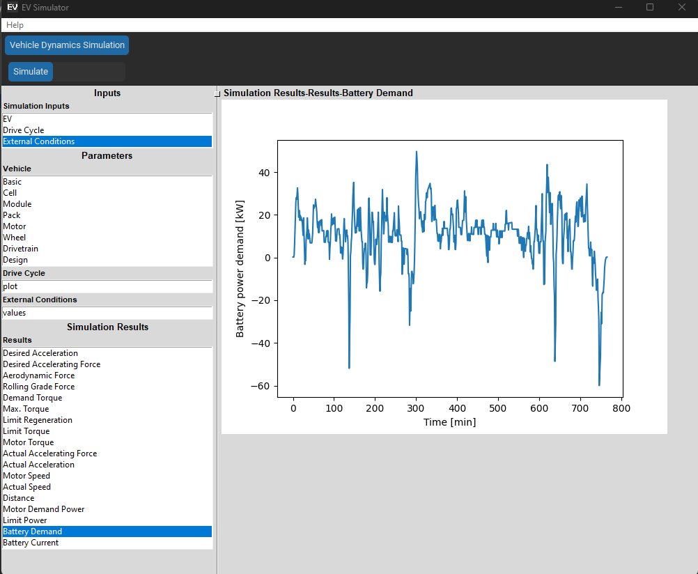

# EV_sim

#### Copywrite©️ 2023 by Moin Ahmed. All Rights Reserved.

This repository contains the Python source code for simulating the power and energy demand of an electric vehicle 
(EV) during its drive cycle. This simulation takes in various vehicle parameters as its inputs. The simulation uses the 
methods described by Gillespie1 and Plett2.

To summarize, the demanded motor power is calculated at every time step. This calculation is done by first calculating 
the desired speed, acceleration, force, and torques. The motor characteristics limit these desired variables, and hence 
the limited torque and actual forces, acceleration, and speed are then calculated2.

### Features
- Graphic User Interface (GUI)
  - One way to execute gui is to run <code>python -m EV_sim</code> on the command line.
  

### Installation
Either of the two recommended installation procedures can be used and the steps for these installation procedures are
listed below.
#### Git Clone
1. Ensure numpy (https://numpy.org/), pandas (https://pandas.pydata.org/), and Matplotlib (https://matplotlib.org/) 
are installed in your system.
2. Clone the repository, for example using <code>git clone git@github.com:m0in92/EV_sim.git</code> using Git Bash.
#### Python setup
1. Download or clone this repository
2. Ensure you are on the repository directory (where the setup.py resides) and run 
<code>python setup.py sdist</code> on the command line.
3. Step 2 will create a dist directory in the repository. Extract the contents tar.gz file in this directory. Move to
the directory where the extracted files reside and run <code>pip install EV_sim</code> on the command line. This 
will install EV_sim on your system (along with the external dependencies) and EV_sim can be imported as any other Python
package.

### Basic Usage
#### Using Source code

Import the EV_sim module using Python's import command, and this imports relevant submodules within EV_sim.

<code>import EV_sim</code>

Simulation requires instances of three classes: 
1. EV
2. DriveCycle
3. ExternalConditions

Then, "EV" class object needs to be initialized. Various vehicle parameters needs to be defined to initialize it. Instead,
EV_sim provides a database of commercial electric vehicles (EV), which contains all the relevant required parameters. For the 
list of supported commercial EV, refer to the "Vehicles in the Database" section. When using the parameters from the
database, "EVfromDatabase" class object (derived child of EV class) is called instead. The "EVfromDatabase" takes 
vehicle alias as its input parameter. In EV_sim, vehicle alias is a string and follows the convention: 
'manufacturer_year_model name_trim'.

For example:

<code> alias_name = "Tesla_2022_Model3_RWD" </code> 
<code> volt = EV_sim.EVFromDatabase(alias_name=alias_name) </code>

Specify the DriveCycle and ExternalConditions class objects.  

<code> udds = EV_sim.DriveCycle(drive_cycle_name="us06") </code>  
<code> waterloo = EV_sim.ExternalConditions(rho=1.225, road_grade=0.3) </code>

Finally, declare the VehicleDynamics object and use it's simulate method. 

<code> model = EV_sim.VehicleDynamics(ev_obj=volt, drive_cycle_obj=udds, external_condition_obj=waterloo) </code>  
<code> sol = model.simulate() </code>

#### Using GUI

One way to execute gui is to run <code>python -m EV_sim</code> on the command line.

### Vehicles in the Database:

The following vehicles and their corresponding vehicle alias names are listed below. This list will be updated as the 
vehicle database grows. For sources of the vehicle parameters in the database, refer to the References section.
Please note that certain approximations and assumptions were made for the vehicle parameters. Feel free to contact the
author for more details, corrections, and/or contributions.

- Audi 2021 e-tron 55 quattro  : Audi_2021_e-tron 55 quattro
- Chevy 2017 Volt  : Volt_2017
- Tesla 2022 Model 3 RWD : Tesla_2022_Model3_RWD
- Tesla 2022 Model 3 Long Range AWD : Tesla_2022_Model3_LongRangeAWD
- Tesla 2022 Model 3 Performance AWD : Tesla_2022_Model3_PerformanceAWD
- Tesla 2022 Model S Plaid Tri Motor : Tesla_2022_ModelS_PlaidTriMotorAWD
- Tesla 2022 ModelS Long Range : Tesla_2022_ModelS_LongRange
- Tesla 2022 ModelX  : Tesla_2022_ModelX
- Tesla 2022 ModelX Plaid : Tesla_2022_ModelX_Plaid
- Tesla 2022 ModelY RWD : Tesla_2022_ModelY_RWD
- Tesla 2022 ModelY Long Range AWD : Tesla_2022_ModelY_LongRangeAWD
- Tesla 2022 ModelY Performance AWD : Tesla_2022_ModelY_PerformanceAWD

### Drive Cycles in the Package:
- Air Conditioning Supplemental Driving Schedule (sc03) 10
- Braunschweig City Driving Cycle (bcdc) 9
- Federal Test Procedure (ftp) 10
- Highway Fuel Economy test (hwfet)
- New York City Cycle (nycc)
- Unified Cycle Driving Schedule (ucds) 9
- US06 (us06)
- Urban Dynamometer Driving Schedule (udds)

### File Directories
- Assets: Contains images for the README.md file
- EV_Sim: Source code
  - config: path configurations 
  - examples: example implementation using source code 
  - data: datafiles for EVs and drive cycles
  - utils: utility code for timing simulation times and printing useful database information.
- tests: Test code using the results from MATLAB code2.

### References
1. Gillespie, T. D. (Thomas D. ). (1992). Fundamentals of vehicle dynamics.
2. Plett, G. (2015). Simulating Battery Packs. In Battery Management Systems, vol 2 (1st Edition, pp. 31–67). Artech House.
3. https://evspecifications.com
4. https://ev_database.org
5. https://insideevs.com/
6. https://www.torquenews.com/
7. https://www.guideautoweb.com/en/
8. https://www.caranddriver.com/
9. https://www.nrel.gov/transportation/drive-cycle-tool/
10. https://www.epa.gov/vehicle-and-fuel-emissions-testing/dynamometer-drive-schedules
11. https://www.batterydesign.net/
12. https://pushevs.com/2021/03/30/ncm-712-by-lg-chem-e66a-and-e78-battery-cells/
